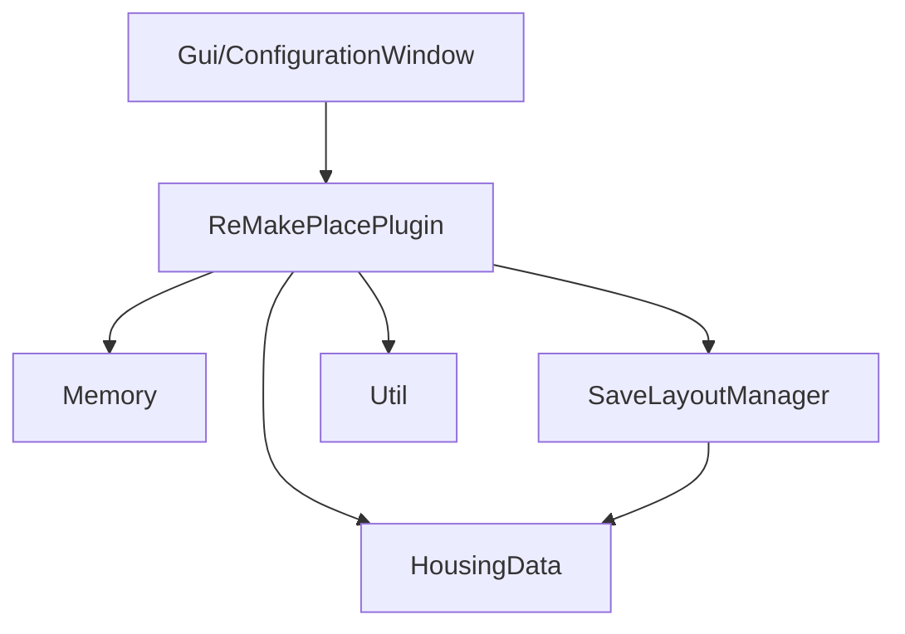
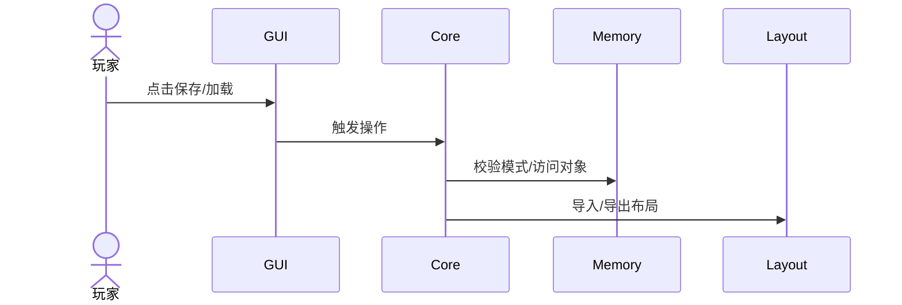

# 架构设计

## 总体架构

## 技术栈
- **后端:** C#/.NET（Dalamud 插件）
- **前端:** ImGui（Dalamud UI）
- **数据:** Lumina Excel Sheets / JSON 布局文件

## 核心流程

## 重大架构决策
完整的 ADR 存储在各变更的 how.md 中，本章节提供索引。

| adr_id | title | date | status | affected_modules | details |
|--------|-------|------|--------|------------------|---------|
| - | - | - | - | - | - |